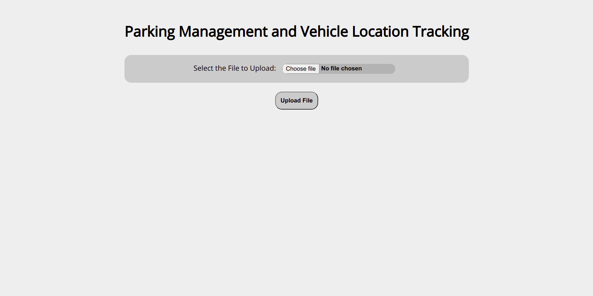
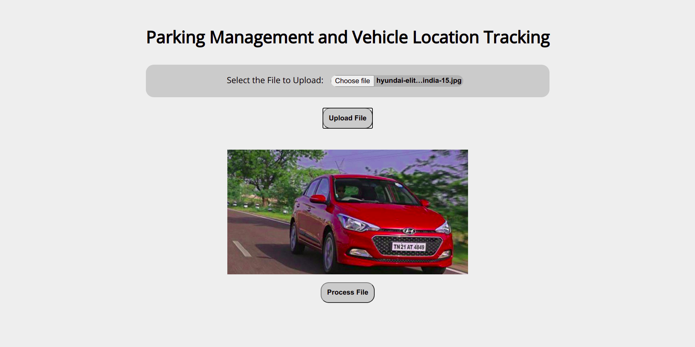
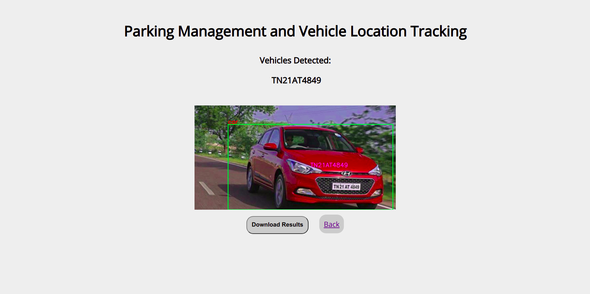

# Parking_Management

## Table of contents
* [About](#about)
* [Features](#features)
* [Packages Used](#packages-used)
* [Setup](#setup)
* [Usage](#usage)
* [Screenshots](#screenshots)
* [References](#references)

## About

This project aims at efficiently handling vehicle parking services across parking lots. Vehicles are uniquely identified using their number plate information and tracked across camera locations. The location of a parked car is monitored for easy reference and access. Parking slot vacancy is also computed for managing the parking capacity of a parking lot. Focus has been placed in making the system robust for handling low-light surroundings and unconstrained camera angles.

## Features

- Vehicle Detection Models are based on the YOLOv4 architecture executed using the darknet framework
- ALPR is handled using a custom Keras Model for Licence Plate Detection and a YOLO based Detector for performing Numberplate character OCR

## Packages Used
- TensorFlow - 1.15.4 (CPU) / TensorFlow 1.13.1 (GPU - Colab) 
- Keras - 2.2.4
- FastAPI
- OpenCV
- imutils
- nest-asyncio
- pyngrok
- asgiref

## Setup

### Requirements
- Python 3.6+

### Installation
- To install required packages on local system:<br>
```bash
pip install -r requirements.txt
```

- For CPU Only execution, do the corresponding changes in ```./darknet/Makefile```
```
GPU = 0
CUDNN = 0
CUDNN_HALF = 0
```

- Building YOLO Darknet Binaries
```bash
cd darknet && make
```

## Usage

```bash
python main.py
```

To test out the repository on Google Colab, [click on this link](https://colab.research.google.com/drive/1QljiKUGbN4uaLOo8leRWZYxHummz376k?usp=sharing)

## Screenshots

### File Upload UI

<br>

### Preview Uploaded Image/Video

<br>

### View Detected cars and their Licence Plate Info

<br>


## References

- Vehicle Detection: <https://arxiv.org/abs/2011.04244>
- Licence Plate Detection in Unconstrained Scenes: <http://sergiomsilva.com/pubs/alpr-unconstrained/>


